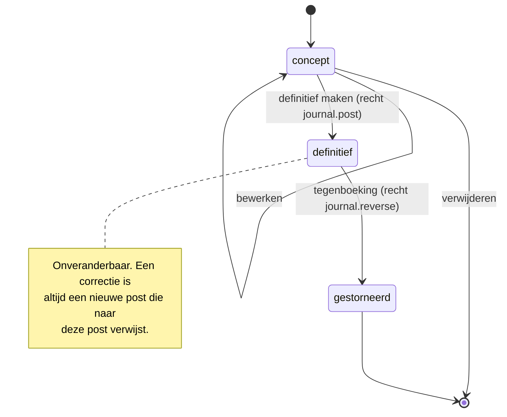

# De boekhoudkundige kern

De engine is opzettelijk klein, puur en zonder I/O. Alles wat rekent staat in
`packages/accounting`; alles wat opslaat staat in `apps/api/src/modules/ledger`.
Daardoor is de rekenkern volledig property-based testbaar.

## Bedragen: `packages/money`

Een bedrag is een `Money`: een `bigint` in **minor units** (centen) plus een
valutacode. Er komt nergens een `number` aan te pas.

```ts
const a = Money.fromString('121.00', 'EUR');
const b = Money.fromString('21.00', 'EUR');
a.minus(b).toString();      // "100.00"
a.times(3).toString();      // "363.00"
```

Delen en percentages gebruiken **banker's rounding niet**, maar de in Nederland
gebruikelijke `half up`-afronding op de kleinste eenheid, met een expliciete
`allocate`-functie voor het verdelen van een bedrag zonder centverlies:

```ts
Money.fromString('100.00','EUR').allocate([1,1,1]);
// [33.34, 33.33, 33.33] — som is exact 100.00
```

## Btw-berekening

Btw wordt per regel berekend en per btw-code gegroepeerd, nooit over het
factuurtotaal. Dat is de enige methode die aansluit op de aangifte.

```
regelbedrag_excl = afronden(aantal * prijs) - korting
btw_per_regel    = afronden(regelbedrag_excl * tarief)
factuurtotaal    = som(regelbedragen) + som(btw per btw-code)
```

Bij inclusief ingevoerde prijzen wordt eerst teruggerekend:
`excl = afronden(incl / (1 + tarief))`, waarna de btw het verschil is. Zo sluit
het inclusiefbedrag altijd exact aan.

Btw-codes zijn **data, geen code**: tarief, geldigheidsperiode, aangiftevak,
verlegd-ja/nee en IC-levering-ja/nee staan in `tax_code` met `valid_from`/`valid_to`.
Een tariefwijziging is een migratie met nieuwe rijen, niet een codewijziging;
bestaande boekingen blijven naar de code verwijzen die op de boekingsdatum gold.

## Journaalpost

```ts
type ConceptEntry = {
  journalCode: string;
  entryDate: string;          // ISO-datum, bepaalt de periode
  description: string;
  lines: ConceptLine[];       // minimaal twee
  sourceType?: 'sales_invoice' | 'purchase_invoice' | 'bank_transaction' | 'manual';
  sourceId?: string;
};
```

`buildEntry()` in `packages/accounting` maakt van een concept een gevalideerde
post, of gooit een `AccountingError` met een foutcode. Er is geen pad waarlangs
een ongeldige post de database bereikt.

### Invarianten (afgedwongen in code én in de database)

| # | Invariant | Waar afgedwongen |
| --- | --- | --- |
| I1 | Som debet = som credit, exact | `buildEntry` + `CHECK`-constraint via trigger op `journal_entry` bij `posted` |
| I2 | Elke regel heeft debet **of** credit > 0, niet beide, niet geen van beide | `buildEntry` + `CHECK (debit >= 0 AND credit >= 0 AND (debit = 0) <> (credit = 0))` |
| I3 | Minimaal twee regels | `buildEntry` + trigger |
| I4 | Alle regels in dezelfde administratie als de post | RLS + foreign key op `(administration_id, id)` |
| I5 | Definitieve post is onveranderbaar | trigger `journal_entry_immutable` weigert `UPDATE`/`DELETE` op `status = 'posted'` behalve de overgang naar `reversed` |
| I6 | `journal_line` van een definitieve post is onveranderbaar | trigger `journal_line_immutable` |
| I7 | Boeken in een gesloten periode kan niet | trigger die `accounting_period.status` controleert |
| I8 | Postnummer is uniek en opeenvolgend per dagboek per jaar | `number_sequence` met `SELECT ... FOR UPDATE` + unieke index |
| I9 | Boekingsdatum valt in de gekoppelde periode | trigger |
| I10 | Vreemde valuta: `debit`/`credit` is altijd in administratievaluta; `amount_currency` + `exchange_rate` bewaren het origineel | `buildEntry` |

Invarianten I1-I3 en I10 worden bovendien met **property-based tests**
(`fast-check`) gecontroleerd op willekeurige geldige en ongeldige invoer.

## Statussen en corrigeren



Een tegenboeking krijgt dezelfde regels met debet en credit verwisseld, dezelfde
datum (of de eerste dag van de eerstvolgende open periode als de oorspronkelijke
periode gesloten is), en `reverses_entry_id` naar het origineel. De originele
post krijgt status `reversed`. Beide blijven zichtbaar in het journaal — de
geschiedenis wordt nooit gladgestreken.

## Boekingspatronen

### Verkoopfactuur (21% btw)

| Rekening | Debet | Credit |
| --- | --- | --- |
| 1300 Debiteuren | 1.210,00 | |
| 8000 Omzet | | 1.000,00 |
| 1500 Af te dragen btw hoog | | 210,00 |

### Inkoopfactuur (21% btw, aftrekbaar)

| Rekening | Debet | Credit |
| --- | --- | --- |
| 4300 Kosten | 1.000,00 | |
| 1520 Te vorderen btw | 210,00 | |
| 1600 Crediteuren | | 1.210,00 |

### Betaling ontvangen

| Rekening | Debet | Credit |
| --- | --- | --- |
| 1100 Bank | 1.210,00 | |
| 1300 Debiteuren | | 1.210,00 |

### Btw-verlegd (inkoop, artikel 12 lid 5 Wet OB)

| Rekening | Debet | Credit |
| --- | --- | --- |
| 4300 Kosten | 1.000,00 | |
| 1520 Te vorderen btw | 210,00 | |
| 1510 Verlegde btw af te dragen | | 210,00 |
| 1600 Crediteuren | | 1.000,00 |

Netto btw-effect nul, maar beide kanten worden geboekt zodat de aangifte de
juiste vakken vult.

### Intracommunautaire levering (0%, ICP)

| Rekening | Debet | Credit |
| --- | --- | --- |
| 1300 Debiteuren | 1.000,00 | |
| 8010 Omzet EU-leveringen | | 1.000,00 |

De regel draagt btw-code `IC-LEV`; het bedrag komt in vak 3b van de aangifte en
in de ICP-opgave per btw-identificatienummer.

### Deelbetaling

Een betaling van 500,00 op een factuur van 1.210,00 boekt 500,00 van 1300 af en
maakt een `payment_allocation` van 500,00. De factuur blijft `open` met een
restant van 710,00. De ouderdomsanalyse rekent met het restant, niet met het
factuurbedrag.

### Betalingsverschil en afronding

Verschil binnen de ingestelde tolerantie (standaard EUR 0,02, per administratie
instelbaar) wordt met een expliciete extra regel op `4990 Betalingsverschillen`
geboekt, met een eigen omschrijving. Nooit stilzwijgend.

### Vreemde valuta

Een factuur in USD wordt geboekt tegen de koers op factuurdatum. Bij betaling
tegen een andere koers ontstaat een koersverschil, dat als aparte regel op
`4980 Koersverschillen` gaat. De invariant blijft: debet = credit in
administratievaluta.

## Afsluiten

* **Periode blokkeren** (`locked`): boeken kan alleen nog met het recht
  `period.reopen`; elke uitzondering komt in de audit trail met reden.
* **Periode sluiten** (`closed`): boeken kan niet meer; heropenen vereist
  hetzelfde recht en een verplichte motivatie.
* **Boekjaar afsluiten** (fase 4): resultaatrekeningen worden via een
  afsluitpost naar het eigen vermogen geboekt en de beginbalans van het nieuwe
  jaar wordt als openingspost in dagboek `OPEN` weggeschreven.

## Aansluiting van rapportages

De rapportagelaag leest **uitsluitend** uit `journal_line`. Er is geen tweede
administratie van saldi. De balans en W&V zijn aggregaties over dezelfde rijen
die het journaal toont, waardoor "het rapport klopt niet met het grootboek"
structureel onmogelijk is. Een test controleert per willekeurig gegenereerde
administratie dat:

```
som(balans activa) - som(balans passiva) - resultaat(W&V) = 0
som(rapportregel) = som(journaalregels achter de drill-down van die regel)
```
