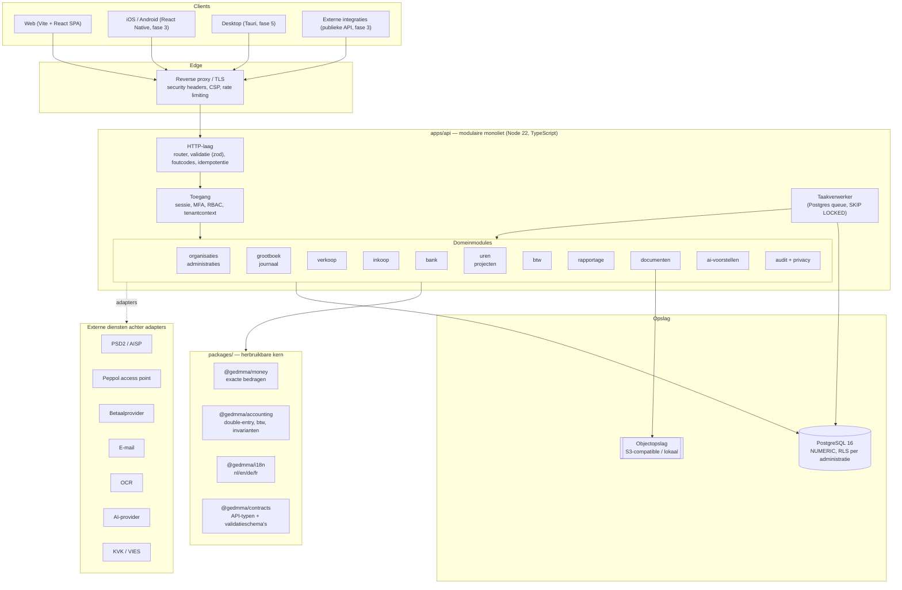
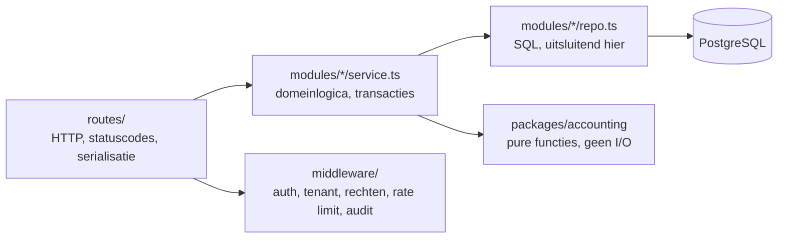

# Technische architectuur

## Uitgangspunt

Gedmma is een **modulaire monoliet** in één TypeScript-monorepo. Alle domeinen
draaien in één proces met strikt gescheiden modules en expliciete grenzen, zodat
een module later zonder herbouw naar een eigen service kan verhuizen. Voor een
financieel systeem is dat de juiste keuze: een boeking, de btw-berekening, de
documentnummerreeks en de audit trail moeten in **één databasetransactie**
slagen of falen. Gedistribueerde transacties zouden dat onnodig ingewikkeld en
foutgevoelig maken.

## Systeemoverzicht



## Waarom deze keuzes

| Keuze | Motivatie | Alternatief dat is afgewogen |
| --- | --- | --- |
| Modulaire monoliet | Financiële consistentie in één transactie; eenvoud in beheer | Microservices — te vroeg, dwingt eventual consistency af op het grootboek |
| PostgreSQL 16 | `NUMERIC` zonder afrondingsverlies, row-level security, `SKIP LOCKED`, sterke transacties | MySQL (zwakkere RLS), SQLite (geen multi-tenant productie) |
| `pg` + eigen migratierunner en query-laag | Volledige controle over transacties, RLS-sessievariabelen en exacte `NUMERIC`-afhandeling | Prisma — zie [decision-log.md](decision-log.md) ADR-003 |
| Vite + React SPA | Ingelogde back-office heeft geen SSR/SEO nodig; identieke bundel herbruikbaar in Tauri | Next.js — zie ADR-004 |
| Node 22 native TypeScript | Geen buildstap voor de backend, snelle start, stack blijft klein | tsc/SWC-buildstap — nodig zodra decorators worden gebruikt |
| Taken in PostgreSQL | Werkt out of the box, transactioneel met de boeking, `FOR UPDATE SKIP LOCKED` | Redis + BullMQ — als driver achter dezelfde interface vanaf fase 3 |
| Eigen HTTP-laag op Express | Geen decorators nodig, dus geen buildstap; expliciete validatie | NestJS — zie ADR-002 |

De afwijkingen van de gevraagde voorkeursstack (Prisma, NestJS, Next.js) staan
met volledige onderbouwing in [decision-log.md](decision-log.md). Alle overige
voorkeuren (TypeScript-monorepo, PostgreSQL, Redis/BullMQ-driver, S3, REST/OpenAPI,
React Native, Tauri, Docker, structured logging) zijn overgenomen.

## Mappenindeling

```
apps/
  api/          modulaire monoliet: HTTP, modules, migraties, jobs
  web/          Vite + React SPA met eigen design system
  webscan/      bestaand product Webscan NL (ongewijzigd)
  mobile/       React Native (fase 3)
  desktop/      Tauri (fase 5)
packages/
  money/        exacte bedragen, valuta, afronding
  accounting/   journaalpost, invarianten, btw-berekening, rekeningschema
  contracts/    gedeelde API-typen en validatieschema's
  i18n/         vertalingen en locale-aware formatting
docs/           ontwerp-, security-, privacy- en compliancedocumentatie
scripts/        orkestratie voor test, typecheck, lint, dev
```

## Lagen binnen `apps/api`



Regels die in code worden afgedwongen:

1. **SQL blijft binnen de module.** Query's staan in `repo.ts` (leesmodellen en
   herbruikbare toegang) of in `service.ts` (schrijfacties binnen een
   transactie). De routelaag bevat nooit SQL; een lint-regel weigert het daar.
2. **Domeinlogica staat niet in routes.** Routes valideren invoer, roepen één
   servicefunctie aan en vertalen het resultaat.
3. **`packages/accounting` doet geen I/O.** Alles daarin is puur en dus
   property-based testbaar.
4. **Elke financiële mutatie loopt via `withTransaction`**, die de tenantcontext
   in de sessie zet, de boeking uitvoert en het auditrecord schrijft.

## Tenantcontext

Elke request krijgt een `TenantContext` met `organizationId`, `administrationId`,
`userId` en de effectieve rechten. Die context wordt aan het begin van elke
databasetransactie in de PostgreSQL-sessie gezet:

```sql
SELECT set_config('gedmma.administration_id', $1, true);
SELECT set_config('gedmma.organization_id',   $2, true);
```

Row-level security-policies op elke tenantgebonden tabel lezen die waarden. Een
query zonder context levert nul rijen op — niet per ongeluk alle rijen. Details
in [security.md](security.md).

## Achtergrondtaken

Taken staan in de tabel `job` in dezelfde database als de boekingen. Dat maakt
het mogelijk om een taak **in dezelfde transactie** als de boeking in te plannen
(geen "boeking gelukt, e-mail kwijt"). De verwerker pakt werk op met
`FOR UPDATE SKIP LOCKED`, kent per taak een maximaal aantal pogingen, een
exponentiële backoff en een dead-letter-status.

Taaksoorten in de MVP: PDF genereren, e-mail versturen, bankbestand verwerken,
rapport-cache verversen, retentie- en verwijderjobs, webhookaflevering.

## Realtime

Server-Sent Events op `/api/v1/stream`, per administratie geautoriseerd. Gebruikt
voor: importvoortgang, nieuwe banktransacties, statuswijziging van facturen en
afgeronde achtergrondtaken. SSE is gekozen boven WebSockets omdat het verkeer
eenrichting is en SSE door elke proxy komt.

## Observability

* **Logging**: JSON, één regel per gebeurtenis, met `requestId`, `tenantId`,
  `userId` en duur. Persoonsgegevens worden standaard gemaskeerd; zie
  [privacy-role-matrix.md](privacy-role-matrix.md).
* **Metrics**: Prometheus-formaat op `/metrics` (alleen intern bereikbaar):
  requestduur per route, boekingen per minuut, taakwachtrijlengte, foutratio.
* **Tracing**: OpenTelemetry-compatibele span-identificatie per request,
  doorgegeven aan jobs.
* **Health**: `/health/live` (proces leeft) en `/health/ready` (database,
  migratiestand en objectopslag bereikbaar).

## Performancebudgetten

| Scherm / endpoint | Budget (p95) |
| --- | --- |
| Dashboard laden | < 800 ms |
| Facturenlijst (50 regels) | < 300 ms |
| Factuur definitief maken | < 500 ms |
| Balans / W&V over een boekjaar | < 1.000 ms |
| Bankbestand van 1.000 regels importeren | < 10 s (achtergrondtaak) |
| Grootboekkaart met 10.000 mutaties | < 1.200 ms |

Budgetten worden in CI gemeten op een geseede administratie; overschrijding is
een falende test.
