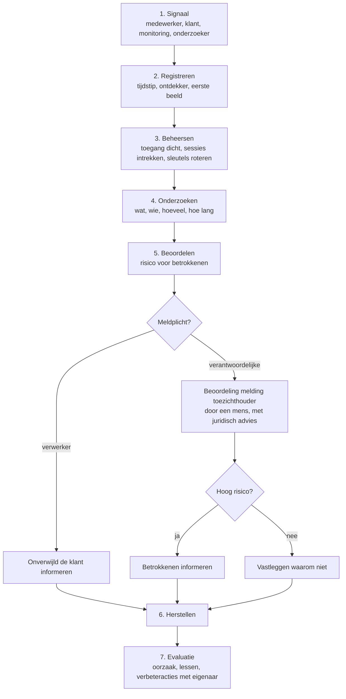

# Datalekprocedure

## Wanneer is iets een datalek

Een inbreuk op de beveiliging die leidt tot vernietiging, verlies, wijziging,
ongeoorloofde verstrekking van of ongeoorloofde toegang tot persoonsgegevens.
Ook per ongeluk: een export naar de verkeerde ontvanger is een datalek.

Twijfel je? Meld het. Beoordelen doet de privacyverantwoordelijke, niet degene
die het ontdekt.

## Meldpunt

*(intern meldadres in te vullen)* — bereikbaar voor iedereen in de organisatie,
en genoemd in de onboarding. Klanten en externe onderzoekers melden via het
adres in `security.txt`.

## Stappen

## Rolverdeling

| Rol | Verplichting |
| --- | --- |
| Exploitant als **verwerker** | De betrokken klant zonder onnodige vertraging informeren, met alles wat die nodig heeft om zijn eigen afweging te maken |
| Klant als **verantwoordelijke** | Beoordelen of hij meldt bij de toezichthouder en of hij betrokkenen informeert; de wettelijke termijn bewaken |
| Exploitant als **verantwoordelijke** (eigen gebruikersgegevens) | Zelf beoordelen en melden |

## Wat er wordt vastgelegd

De tabel `security_incident` bevat: datum en tijd van ontdekking, de ontdekker,
de aard, de getroffen systemen, de categorieën gegevens, het aantal betrokkenen,
de vermoedelijke oorzaak, de genomen maatregelen, de risico-inschatting, de
eigenaar, de communicatie met klanten, of en wanneer er is gemeld bij de
Autoriteit Persoonsgegevens, of betrokkenen zijn geïnformeerd, de tijdlijn, de
bewijsstukken en de geleerde lessen.

## Wat er nadrukkelijk niet gebeurt

**Er wordt nooit automatisch gemeld bij een toezichthouder.** Een melding is een
juridisch besluit met gevolgen; die beoordeling doet een mens, met juridisch
advies. Het systeem ondersteunt: het bewaakt de termijn, verzamelt de feiten en
maakt het dossier compleet.

## Isolatie tussen klanten

Een incident bij één klant is niet zichtbaar voor andere klanten. Het
incidentregister is afgeschermd en de communicatie gaat gericht naar de
getroffen klanten.

## Wat een klant krijgt

Bij een lek dat de klant raakt, ontvangt hij: wat er is gebeurd, wanneer, welke
categorieën gegevens en hoeveel betrokkenen het betreft, wat de waarschijnlijke
gevolgen zijn, welke maatregelen zijn genomen, wat de klant zelf kan doen, en het
contactpunt. Dat is precies wat hij nodig heeft om zijn eigen meldplicht te
beoordelen.

## Oefenen

De procedure wordt jaarlijks geoefend met een fictief scenario. Van de oefening
wordt vastgelegd wat er goed ging, wat niet, en welke verbeteracties eruit
volgden. Een procedure die nooit is geoefend, werkt niet op het moment dat het
telt.
