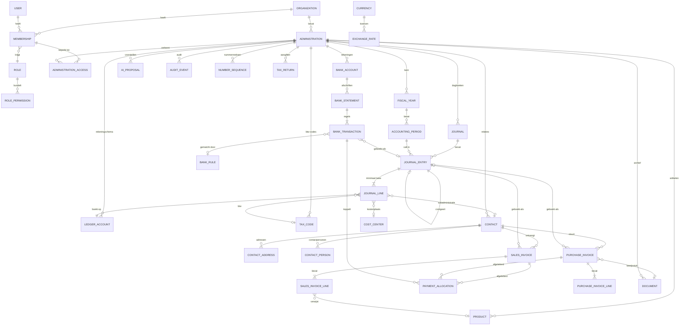

# Datamodel

## Grondregels

1. **Elke tenantgebonden tabel heeft `administration_id`** (en waar nodig
   `organization_id`). Geen enkele financiële tabel is zonder scope.
2. **Bedragen zijn `NUMERIC`**, nooit `float`/`double`. In de applicatie worden
   ze gelezen als string en direct omgezet naar een `Money` (integer minor units).
3. **Grootboekregels zijn onveranderbaar.** Er is geen `UPDATE`-pad naar
   `journal_line` van een definitieve post; corrigeren gebeurt met een nieuwe post.
4. **Alles wat telt heeft een tijdstip en een veroorzaker**: `created_at`,
   `created_by`, en waar relevant `version` voor optimistic locking.
5. **Documentnummers zijn per administratie, per reeks en per jaar uniek en
   opeenvolgend**, afgedwongen met een unieke index en een rijvergrendeling.

## Kern-ER-diagram



## Entiteiten per domein

### Toegang en tenancy

| Entiteit | Sleutelvelden | Toelichting |
| --- | --- | --- |
| `app_user` | `email` (uniek, genormaliseerd), `password_hash`, `mfa_secret_encrypted`, `locale`, `status` | Persoon, niet tenantgebonden |
| `user_credential` | `type` (`password`, `totp`, `recovery`, `passkey`), `secret`, `last_used_at` | Meerdere factoren per gebruiker |
| `session` | `token_hash`, `expires_at`, `rotated_from`, `ip_hash`, `user_agent_hash`, `mfa_satisfied` | Serverzijdig intrekbaar |
| `organization` | `name`, `kvk_number`, `country`, `plan`, `status` | Tenant-hoofdniveau |
| `administration` | `organization_id`, `name`, `legal_form`, `vat_number`, `base_currency`, `chart_template`, `locked_through` | De boekhoudkundige eenheid |
| `membership` | `user_id`, `organization_id`, `role_id`, `status`, `invited_by` | Lidmaatschap met rol |
| `administration_access` | `membership_id`, `administration_id`, `role_id`, `valid_until` | Optionele beperking tot bepaalde administraties, met einddatum voor externe adviseurs |
| `role` / `permission` / `role_permission` | `key`, `scope` | Rechten als vaste sleutels, zie [security.md](security.md) |

### Boekhoudkundige kern

| Entiteit | Belangrijkste velden | Regels |
| --- | --- | --- |
| `fiscal_year` | `starts_on`, `ends_on`, `status` (`open`, `closing`, `closed`) | Mag gebroken zijn; perioden dekken het jaar volledig |
| `accounting_period` | `fiscal_year_id`, `number`, `starts_on`, `ends_on`, `status` (`open`, `locked`, `closed`) | Boeken in `locked`/`closed` alleen met recht `period.reopen` |
| `ledger_account` | `code`, `name`, `type` (`asset`,`liability`,`equity`,`revenue`,`expense`), `rgs_code`, `vat_default`, `is_blocked` | `code` uniek per administratie |
| `journal` | `code`, `name`, `kind` (`sales`,`purchase`,`bank`,`cash`,`memorial`,`opening`) | Dagboek |
| `journal_entry` | `journal_id`, `period_id`, `entry_number`, `entry_date`, `description`, `status` (`draft`,`posted`,`reversed`), `reverses_entry_id`, `source_type`, `source_id`, `posted_at`, `posted_by` | Definitief maken is eenrichting |
| `journal_line` | `entry_id`, `line_number`, `ledger_account_id`, `debit`, `credit`, `currency`, `amount_currency`, `exchange_rate`, `tax_code_id`, `tax_base`, `contact_id`, `cost_center_id`, `description` | Precies één van `debit`/`credit` > 0 |
| `number_sequence` | `key`, `year`, `next_value` | Rijvergrendeling bij uitgifte |
| `tax_code` | `code`, `name`, `kind`, `rate`, `valid_from`, `valid_to`, `box`, `reverse_charge`, `ic_supply` | Tarieven zijn data, geen code |
| `currency` / `exchange_rate` | `code`, `rate_date`, `rate` | `NUMERIC(18,8)` |

### Verkoop, inkoop, bank

| Entiteit | Toelichting |
| --- | --- |
| `sales_invoice` | Kop met `kind` (`quote`,`invoice`,`credit_note`,`proforma`), `status` (`draft`,`final`,`sent`,`paid`,`overdue`,`cancelled`), `document_number`, valuta, totalen, `journal_entry_id` |
| `sales_invoice_line` | Regel met aantal, prijs, korting, `tax_code_id`, grootboekrekening, bedragen exclusief/btw/inclusief |
| `purchase_invoice` / `purchase_invoice_line` | Spiegelbeeld, plus `supplier_invoice_number` (uniek per leverancier: dubbeldetectie) en `document_id` |
| `payment_allocation` | Koppeling tussen banktransactie (of memoriaal) en factuur, met bedrag; maakt deelbetalingen mogelijk |
| `bank_account` | `iban`, `bic`, `currency`, `ledger_account_id`, `provider`, `consent_expires_at` |
| `bank_statement` | Afschrift met begin- en eindsaldo, bron (`csv`,`mt940`,`camt053`,`psd2`), `import_job_id` |
| `bank_transaction` | Datum, bedrag, tegenrekening, naam, omschrijving, `external_id`, `status` (`new`,`suggested`,`matched`,`booked`,`ignored`), `dedupe_hash` |
| `bank_rule` | Voorwaarden (JSON) en actie (grootboek + btw-code); volgorde bepaalt voorrang |

### Uren en projecten

| Entiteit | Toelichting |
| --- | --- |
| `project` | Naam, code, klant, `facturatie` (`uurtarief`,`vaste_prijs`,`niet`), `uurtarief`, `vaste_prijs`, `budget_minuten`, standaard btw-code en omzetrekening |
| `project_activity` | Activiteit binnen een project (ontwerp, overleg, reistijd) met een eigen tarief en factureerbaarheid |
| `time_entry` | `datum`, `minuten` (geheel getal), `omschrijving`, `factureerbaar`, `uurtarief` zoals het gold bij het schrijven, `status` (`concept`,`ingediend`,`goedgekeurd`,`afgekeurd`,`gefactureerd`), `sales_invoice_id` en `sales_invoice_line_id` |

Drie dingen zijn hier in de database vastgelegd en niet aan de applicatie
overgelaten:

* **Minuten zijn gehele getallen.** Een kwartier is 15, niet 0,25. Een decimale
  breuk zou later, als het een bedrag wordt, een afronding introduceren.
* **Het tarief reist mee met het uur.** Een tariefwijziging verandert
  geschreven uren dus niet met terugwerkende kracht.
* **Een gefactureerd uur ligt vast.** Een trigger (`gedmma.uur_is_vast`)
  weigert wijziging en verwijdering, en een `CHECK` bewaakt dat de status
  `gefactureerd` en de verwijzing naar de factuur altijd samen bestaan. Wie
  zich vergist, crediteert de factuur; dat is dezelfde weg als bij een
  definitieve boeking.

### Documenten, AI, audit

| Entiteit | Toelichting |
| --- | --- |
| `document` | `storage_key`, `sha256`, `mime`, `size`, `classification` (`normaal`,`gevoelig`), `retention_until`, `legal_hold`, `original_filename` |
| `document_event` | Elke bewerking op een document (upload, bekijken, downloaden, koppelen, verwijderen) |
| `ai_proposal` | `subject_type`, `subject_id`, `provider`, `model`, `model_version`, `input_digest`, `output`, `confidence`, `rationale`, `status` (`open`,`accepted`,`rejected`,`corrected`), `decided_by`, `decided_at`, `correction` |
| `audit_event` | `at`, `actor_user_id`, `actor_kind`, `administration_id`, `action`, `subject_type`, `subject_id`, `data` (gemaskeerd), `request_id`, `prev_hash`, `hash` |
| `job` | `kind`, `payload`, `run_after`, `attempts`, `max_attempts`, `status`, `last_error` |

De audit-tabel is een **hash-ketting**: `hash = sha256(prev_hash || genormaliseerde rij)`.
Daarmee is knoeien achteraf detecteerbaar zonder externe dienst.

## Tenant-scoping in de praktijk

Elke tenantgebonden tabel:

```sql
CREATE TABLE sales_invoice (
  id                 uuid PRIMARY KEY DEFAULT gen_random_uuid(),
  administration_id  uuid NOT NULL REFERENCES administration(id) ON DELETE RESTRICT,
  ...
);
ALTER TABLE sales_invoice ENABLE ROW LEVEL SECURITY;
ALTER TABLE sales_invoice FORCE ROW LEVEL SECURITY;
CREATE POLICY tenant_isolation ON sales_invoice
  USING (administration_id = current_setting('gedmma.administration_id', true)::uuid);
```

`FORCE ROW LEVEL SECURITY` zorgt dat ook de eigenaar van de tabel aan de policy
gebonden is. De applicatie verbindt met een rol die **geen** `BYPASSRLS` heeft.
Migraties draaien met een aparte rol die dat wel mag.

## Bedragen

| Soort | Kolomtype | In de applicatie |
| --- | --- | --- |
| Bedrag in administratievaluta | `NUMERIC(18,2)` | `Money` (bigint centen) |
| Bedrag in vreemde valuta | `NUMERIC(18,2)` | `Money` met eigen valuta |
| Wisselkoers | `NUMERIC(18,8)` | `Rate` (bigint, schaal 1e8) |
| Aantal | `NUMERIC(18,6)` | `Quantity` (bigint, schaal 1e6) |
| Percentage (btw) | `NUMERIC(9,6)` | `Rate` |

De `pg`-driver levert `NUMERIC` als string; er is een typeparser geregistreerd
die dat afdwingt, zodat een bedrag nooit per ongeluk door `Number()` gaat.

## Indexering (MVP)

```sql
CREATE INDEX ON journal_line (administration_id, ledger_account_id, entry_id);
CREATE INDEX ON journal_entry (administration_id, entry_date);
CREATE INDEX ON journal_entry (administration_id, period_id, status);
CREATE UNIQUE INDEX ON journal_entry (administration_id, journal_id, entry_number);
CREATE UNIQUE INDEX ON sales_invoice (administration_id, document_number)
  WHERE document_number IS NOT NULL;
CREATE UNIQUE INDEX ON purchase_invoice (administration_id, contact_id, supplier_invoice_number)
  WHERE supplier_invoice_number IS NOT NULL;
CREATE UNIQUE INDEX ON bank_transaction (administration_id, bank_account_id, dedupe_hash);
CREATE INDEX ON bank_transaction (administration_id, status, booked_on);
CREATE INDEX ON audit_event (administration_id, at DESC);
```
