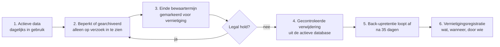

# Bewaartermijnen

## Uitgangspunt

Twee eisen trekken hier aan dezelfde gegevens: de AVG zegt "niet langer dan
nodig", de fiscale bewaarplicht zegt "minimaal zeven jaar". De oplossing is niet
kiezen, maar onderscheiden: **verwijderen** is niet hetzelfde als
**pseudonimiseren**, **afschermen** of **beperken van de verwerking**.

Een verwijderverzoek van een betrokkene leidt daarom niet automatisch tot het
weggooien van een factuur die wettelijk bewaard moet blijven. Wel tot het
afschermen ervan voor dagelijks gebruik, en tot vernietiging zodra de termijn
afloopt.

## Instelbaar per

Bewaartermijnen staan in de tabel `retention_policy` en zijn instelbaar per
organisatie, administratie, land, documentsoort, rechtsgrond, boekjaar, contract,
incident, supportdossier, auditlog en back-up.

## Standaardtermijnen

Deze worden bij het aanmaken van een administratie klaargezet. Ze zijn een
**uitgangspunt** en moeten per klant worden bevestigd; zie
[legal-source-register.md](legal-source-register.md) regel L6.

| Categorie | Termijn | Grondslag | Na afloop |
| --- | --- | --- | --- |
| Financiële administratie (basisgegevens) | 7 jaar na het boekjaar | Fiscale bewaarplicht | Archiveren, daarna vernietigen |
| Gegevens over onroerende zaken | 10 jaar | Herzieningstermijn | Archiveren, daarna vernietigen |
| Documenten bij inkoopfacturen | 7 jaar | Bewijsstuk bij de administratie | Archiveren, daarna vernietigen |
| Auditlog, financieel relevant | 7 jaar | Controleerbaarheid | Vernietigen |
| Auditlog, technisch | 12 maanden | Beveiliging | Vernietigen |
| Sessies en apparaten | 12 maanden | Beveiliging | Vernietigen |
| Supportdossier | 24 maanden | Uitvoering overeenkomst | Pseudonimiseren |
| Facturatie van het abonnement | 7 jaar | Eigen bewaarplicht van de exploitant | Vernietigen |
| Marketingcontacten | Tot intrekking | Toestemming | Naar de suppressielijst |
| Back-ups | 35 dagen | Herstelbaarheid | Automatisch vervallen |
| Incidentregister | 5 jaar na afsluiting | Verantwoording en lering | Beoordelen, daarna vernietigen |

Bij gegevens die onder bijzondere Europese btw-regelingen vallen, kan een langere
termijn gelden. Dat is per klant in te stellen.

## Wat er per gegeven wordt vastgelegd

| Veld | Betekenis |
| --- | --- |
| Categorie | Welke bewaarregel geldt |
| Aanmaakdatum | Wanneer het is ontstaan |
| Start bewaartermijn | Meestal het einde van het boekjaar, niet de aanmaakdatum |
| Grondslag | Wettelijk of contractueel |
| Geplande vernietigingsdatum | Berekend uit de bovenstaande |
| Legal hold | Blokkeert vernietiging zolang die aanstaat |
| Vernietigingsbewijs | Wat wanneer door welk proces is vernietigd |

## De levenscyclus

Stap 5 is de stap die vaak wordt vergeten: gegevens die uit de database zijn
verwijderd, staan nog in de back-ups. Ze zijn pas echt weg als de laatste back-up
die ze bevat is vervallen. Daarom wordt bij een verwijdering ook de datum
vastgelegd waarop de back-upretentie afloopt, en pas daarna is de vernietiging
compleet.

## Herstel uit een back-up

Na een herstel worden de verwijderings- en beperkingsregels **opnieuw
uitgevoerd**. Een hersteld account dat was verwijderd, komt daardoor niet
stilzwijgend terug. Dit is een verplichte stap in de herstelprocedure, zie
[disaster-recovery.md](disaster-recovery.md).

## Bij opzegging

Een klant mag door het beëindigen van zijn abonnement nooit zijn wettelijk
verplichte administratie kwijtraken. Daarom:

1. Bij opzegging: de administratie gaat op **alleen lezen**, niet dicht.
2. De klant krijgt een volledige, leesbare en machineleesbare export aangeboden
   (zie [exit-and-portability-plan.md](exit-and-portability-plan.md)).
3. Er geldt een overgangsperiode waarin de export kan worden gedownload.
4. Pas daarna, en na een expliciete bevestiging, wordt verwijderd.
5. Van de verwijdering krijgt de klant een verklaring.

## Uitvoering

De verwijderjobs draaien via de taakverwerker. Elke uitvoering wordt gelogd: wat
er is beoordeeld, wat er is verwijderd, wat er is overgeslagen en waarom. Een
overgeslagen record (legal hold, lopende procedure) blijft zichtbaar in het
overzicht, zodat het niet ongemerkt blijft staan.
