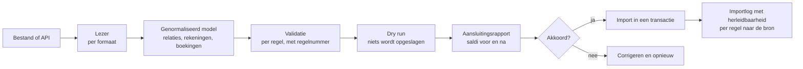

# Import- en migratiestrategie

## Uitgangspunt

Overstappen mag nooit op techniek stuklopen. Dat geldt twee kanten op: naar
Gedmma toe (migratie) en er weer vandaan
([exit-and-portability-plan.md](exit-and-portability-plan.md)).

Belangrijke randvoorwaarde: er wordt **nooit ongeautoriseerd of ongedocumenteerd
toegang gezocht tot systemen van derden**. Migratie gebeurt met bestanden die de
klant zelf exporteert, of via een gedocumenteerde API waarvoor de klant
toestemming geeft.

## Wat er nu werkt

| Bron | Formaat | Status |
| --- | --- | --- |
| Bankafschriften | CSV (elke kolomindeling), MT940, CAMT.053 | werkend, inclusief deduplicatie |
| Relaties | CSV | werkend |
| Rekeningschema | Sjabloon per rechtsvorm | werkend |
| Openingsbalans | Memoriaalpost in dagboek `OPEN` | werkend |
| Volledige administratie eruit | JSON + CSV + documenten | werkend |

## Wat er in fase 2 bij komt

De importwizard met kolommapping, voorbeeldweergave, dry run, rollback,
deduplicatie, importlog en aansluitingsrapport. Het `import_job`-model en de
taakverwerker liggen er al klaar.

## Het migratieframework

Twee eigenschappen zijn niet onderhandelbaar:

1. **Dry run eerst.** Een import laat eerst zien wat er zou gebeuren, inclusief
   het aansluitingsrapport, voordat er iets wordt opgeslagen.
2. **Herleidbaarheid.** Elke geïmporteerde regel bewaart de bron: bestandsnaam,
   regelnummer en de ruwe inhoud. Zonder dat is een controle achteraf onmogelijk.

## Aansluitingsrapport

Na elke import wordt getoond:

| Controle | Uitkomst |
| --- | --- |
| Aantal regels gelezen, geïmporteerd, overgeslagen | telling |
| Openingsbalans debet = credit | ja/nee |
| Saldo per grootboekrekening voor en na | verschil |
| Openstaande debiteuren volgens bron en volgens Gedmma | verschil |
| Openstaande crediteuren volgens bron en volgens Gedmma | verschil |
| Btw-saldi per vak | verschil |

Een verschil blokkeert de import niet, maar wordt wel getoond en vastgelegd. Er
zijn legitieme redenen voor een verschil (afrondingen in de bron, posten die de
klant bewust niet meeneemt); stilzwijgend doorgaan is er geen.

## Deduplicatie

| Soort | Sleutel |
| --- | --- |
| Banktransactie | hash over rekening, datum, bedrag, tegenrekening en omschrijving |
| Inkoopfactuur | leverancier + factuurnummer (unieke index in de database) |
| Relatie | genormaliseerde naam; een vermoeden wordt gemeld, de gebruiker beslist |
| Document | SHA-256 van de inhoud |

## Volgorde van migreren

1. Rekeningschema (of een sjabloon kiezen en aanvullen).
2. Btw-codes controleren.
3. Relaties.
4. Openingsbalans per de startdatum.
5. Openstaande verkoopfacturen.
6. Openstaande inkoopfacturen.
7. Banktransacties vanaf de startdatum.
8. Documenten koppelen.
9. Aansluitingsrapport en akkoord van de klant.

Historie van vóór de startdatum wordt niet geboekt maar gearchiveerd: de klant
houdt zijn oude pakket of een export als bewijsstuk voor de bewaarplicht. Dat
scheelt een risicovolle massale conversie en is fiscaal even goed.

## Migratieadapters

Per bronpakket is een adapter nodig die het exportformaat naar het
genormaliseerde model vertaalt. De adapters zijn generiek opgezet: de meeste
pakketten exporteren CSV of XML met dezelfde begrippen onder andere namen. Een
nieuwe adapter is een kolommapping plus eventueel een omrekening, geen nieuwe
importmotor.

Waar een auditfile beschikbaar is, heeft die de voorkeur: dat is een
gestandaardiseerd formaat en dus minder foutgevoelig dan een zelfgemaakte export.
De ondersteuning daarvan staat op de roadmap voor fase 2; zie
[compliance-matrix.md](compliance-matrix.md) voor de status.
