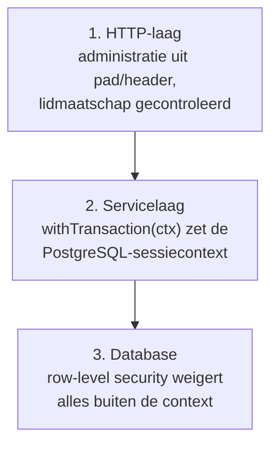

# Beveiligingsarchitectuur

## Uitgangspunt

Financiële gegevens zijn zowel bijzonder gevoelige bedrijfsinformatie als
persoonsgegevens. Het ontwerp gaat uit van *assume breach*: één fout mag nooit
tot toegang tot een andere tenant leiden.

## Tenantisolatie — de gekozen strategie

**Gedeeld schema met verplichte row-level security in PostgreSQL, plus een
applicatielaag die dezelfde grens onafhankelijk bewaakt.**

| Optie | Afweging |
| --- | --- |
| Database per tenant | Sterkste isolatie, maar onhoudbaar bij honderdduizenden organisaties; migraties en rapportage over administraties worden onwerkbaar |
| Schema per tenant | Zelfde bezwaar op grote schaal; `search_path`-fouten zijn stil |
| **Gedeeld schema + RLS** (gekozen) | Schaalt, één migratiepad, en de database weigert zelf ongeautoriseerde rijen — ook als de applicatiecode een `WHERE` vergeet |

### Hoe het werkt

1. De applicatie verbindt met de rol `gedmma_app`. Die rol heeft **geen**
   `BYPASSRLS` en is niet de eigenaar van de tabellen.
2. Elke tenantgebonden tabel heeft `ENABLE ROW LEVEL SECURITY` én
   `FORCE ROW LEVEL SECURITY`.
3. Aan het begin van elke transactie zet de applicatie de context:
   `set_config('gedmma.administration_id', $1, true)` (transaction-scoped).
4. De policy luidt:
   `USING (administration_id = current_setting('gedmma.administration_id', true)::uuid)`.
5. **Zonder context levert elke query nul rijen op.** Dat is bewust: de faalstand
   is "niets zien", niet "alles zien".
6. Een `WITH CHECK`-clausule voorkomt dat een `INSERT`/`UPDATE` een rij naar een
   andere administratie schrijft.

### Drie onafhankelijke lagen



Elke laag alleen is voldoende om een lek te voorkomen; ze zijn er alle drie zodat
een fout in één laag niet fataal is.

### Getest, niet aangenomen

De testsuite bevat `tenantisolatie`-tests die voor elke tenantgebonden tabel
proberen om vanuit administratie A een rij van administratie B te lezen, te
wijzigen, te verwijderen en aan te maken — via de API én rechtstreeks op de
databaseverbinding. De test faalt als er ook maar één rij terugkomt. Er is een
metatest die controleert dat **elke** tabel met een `administration_id`-kolom
ook daadwerkelijk een RLS-policy heeft; een nieuwe tabel zonder policy laat de
build vallen.

## Identiteit en toegang

| Onderdeel | Implementatie |
| --- | --- |
| Wachtwoorden | `scrypt` (N=2^16, r=8, p=1) met per-gebruiker salt en een server-side pepper uit de secrets; hasher is verwisselbaar via een interface, met migratiepad naar Argon2id |
| Wachtwoordbeleid | Minimaal 12 tekens, controle tegen een lijst met veelgebruikte wachtwoorden; geen verplichte rotatie |
| MFA | TOTP (RFC 6238, SHA-1, 6 cijfers, 30 s, ±1 window) met 10 eenmalige herstelcodes; secret versleuteld opgeslagen |
| Passkeys | WebAuthn, fase 2; het credentialmodel is er al op ingericht |
| Sessies | Ondoorgrondelijk token (32 bytes), alleen als SHA-256-hash opgeslagen; `HttpOnly`, `Secure`, `SameSite=Lax`; rotatie bij elke privilegewijziging; serverzijdig intrekbaar |
| Sessieduur | 12 uur absoluut, 30 minuten inactiviteit; korter voor accountants-/supporttoegang |
| Brute force | Per account en per IP oplopende vertraging, daarna tijdelijke blokkade; mislukte pogingen in de audit trail |
| Apparaatoverzicht | Gebruiker ziet actieve sessies met tijd, plaats (grof) en apparaat, en kan ze intrekken |

## Rechtenmodel

Rollen zijn bundels van vaste rechtsleutels. De rechten die het spec als
kritiek benoemt, bestaan één-op-één als sleutel:

| Sleutel | Betekenis |
| --- | --- |
| `journal.create` | Boeking aanmaken (concept) |
| `journal.post` | Boeking definitief maken |
| `journal.reverse` | Tegenboeking maken |
| `period.reopen` | Gesloten of geblokkeerde periode openen |
| `bank.link` | Bankrekening koppelen |
| `payment.prepare` | Betaling voorbereiden |
| `payment.approve` | Betaling goedkeuren |
| `report.export` | Rapport exporteren of downloaden |
| `user.manage` | Gebruikers en rollen beheren |
| `accountant.grant` | Accountantstoegang verlenen |
| `audit.read` | Auditlogs inzien |
| `privacy.manage` | Privacyverzoeken en instellingen beheren |
| `document.read.sensitive` | Als gevoelig geclassificeerde documenten inzien |

### Functiescheiding

`payment.prepare` en `payment.approve` kunnen niet door dezelfde gebruiker op
dezelfde betaalbatch worden uitgeoefend. Dat is geen instelling maar een
controle in de servicelaag, met een expliciete uitzonderingsprocedure voor
eenmanszaken (die de uitzondering per administratie moeten aanzetten, wat in de
audit trail komt).

### Standaardrollen

| Rol | Bedoeld voor | Kern |
| --- | --- | --- |
| `owner` | Eigenaar | Alles binnen de organisatie |
| `admin` | Beheerder | Alles behalve organisatie opheffen |
| `bookkeeper` | Boekhouder | Boeken, definitief maken, rapporteren; geen gebruikersbeheer |
| `accountant` | Externe accountant | Als `bookkeeper`, plus `period.reopen`, met einddatum op de toegang |
| `employee` | Medewerker | Uren, bonnen, eigen declaraties; geen grootboek |
| `viewer` | Meekijker | Alleen lezen, geen export |
| `support` | Interne support | Geen standaardtoegang; alleen via impersonatie, zie hieronder |

## Impersonatie voor support

Support heeft **geen** permanente toegang tot klantadministraties. Toegang
ontstaat alleen als:

1. een bevoegde gebruiker van de klant expliciet toestemming geeft (per verzoek);
2. de support-medewerker een reden invult die aan een supportticket hangt;
3. de sessie automatisch afloopt (standaard 60 minuten, maximaal 8 uur);
4. de sessie in de audit trail staat als `support.impersonation.started`
   en `...ended`, met alles wat er tijdens de sessie gebeurde gemarkeerd als
   `actor_kind = 'support'`;
5. de klant een melding krijgt bij start en een overzicht achteraf.

Support kan tijdens impersonatie nooit `payment.approve`, `user.manage`,
`report.export` of `privacy.manage` uitoefenen.

## Applicatiebeveiliging

| Risico | Maatregel |
| --- | --- |
| SQL-injectie | Uitsluitend geparametriseerde query's; SQL alleen in `repo.ts`; lint-regel verbiedt stringinterpolatie in query's |
| XSS | React escapet standaard; `dangerouslySetInnerHTML` is verboden via lint; strikte CSP zonder `unsafe-inline` (nonce-gebaseerd) |
| CSRF | `SameSite=Lax`-cookie plus `Origin`-controle op elke onveilige methode; API-tokens gaan via de `Authorization`-header, niet via cookies |
| SSRF | Uitgaande verzoeken (webhooks, e-mailimport, adapters) alleen naar een allowlist; DNS-resolutie gecontroleerd op private ranges; geen redirects naar interne adressen |
| Bestandsupload | Extensie- én magic-byte-controle, maximale grootte, geen uitvoerbare typen, opslag buiten de webroot, downloads via kortlopende ondertekende links, virusscan-adapter (ClamAV) |
| Path traversal | Opslagsleutels zijn gegenereerde UUID's; de oorspronkelijke bestandsnaam is alleen metadata |
| Massa-toewijzing | Elke request wordt door een `zod`-schema gehaald; onbekende velden worden geweigerd |
| Race conditions | `SELECT ... FOR UPDATE` op nummerreeksen; optimistic locking (`version`) op facturen en boekingen |
| Dubbele verwerking | Idempotency-key op alle schrijvende endpoints, 24 uur bewaard met het antwoord |
| Enumeratie | Login- en wachtwoordvergeten-antwoorden zijn niet te onderscheiden voor bestaande en niet-bestaande accounts |
| Rate limiting | Per IP, per gebruiker en per tenant, met aparte, strengere limieten op login, export en documentdownload |

## HTTP-beveiligingsheaders

```
Strict-Transport-Security: max-age=63072000; includeSubDomains; preload
Content-Security-Policy: default-src 'self'; script-src 'self' 'nonce-<per request>';
  style-src 'self' 'nonce-<per request>'; img-src 'self' data: blob:;
  connect-src 'self'; font-src 'self'; object-src 'none'; frame-ancestors 'none';
  base-uri 'none'; form-action 'self'
X-Content-Type-Options: nosniff
Referrer-Policy: strict-origin-when-cross-origin
Permissions-Policy: camera=(), microphone=(), geolocation=(), payment=()
Cross-Origin-Opener-Policy: same-origin
Cross-Origin-Resource-Policy: same-origin
```

## Encryptie

| Laag | Maatregel |
| --- | --- |
| Transport | TLS 1.3 (minimaal 1.2), HSTS, moderne ciphers |
| Database at rest | Volledige schijfversleuteling bij de hoster + kolomversleuteling (AES-256-GCM) voor MFA-secrets, bank-tokens en API-secrets |
| Objectopslag | Server-side encryptie; documenten aanvullend per tenant versleuteld met een sleutel uit de KMS |
| Sleutelbeheer | Sleutels in een KMS/secrets manager, nooit in de repository; `KEY_VERSION` per versleuteld veld zodat rotatie zonder downtime kan |
| Rotatie | Sessiegeheim per kwartaal, datasleutels jaarlijks, API-secrets op verzoek en bij verdenking |

## Auditlogging

Zie `docs/data-model.md` voor de tabel. Kernpunten:

* **Append-only**: er is geen `UPDATE`- of `DELETE`-recht op `audit_event` voor
  de applicatierol; een trigger weigert het bovendien.
* **Hash-ketting**: elke rij bevat de hash van de vorige rij binnen dezelfde
  administratie. Manipulatie is detecteerbaar met `audit verify`.
* **Minimale persoonsgegevens**: het `data`-veld bevat alleen wat nodig is om de
  gebeurtenis te begrijpen; bedragen en identificatoren wel, vrije tekst en
  documentinhoud niet.
* **Eigen bewaartermijn**, los van de administratie (standaard 7 jaar voor
  financieel relevante gebeurtenissen, 1 jaar voor technische).
* **Tenantgebonden**: RLS geldt ook hier; niemand ziet audit van een andere tenant.

Verplicht gelogde gebeurtenissen staan in
[data-subject-rights-procedure.md](data-subject-rights-procedure.md) en
[technical-and-organisational-measures.md](technical-and-organisational-measures.md).

## Bedreigingsmodel (STRIDE, samengevat)

| Dreiging | Scenario | Belangrijkste maatregel |
| --- | --- | --- |
| **S**poofing | Gestolen sessiecookie | Korte sessies, rotatie, apparaatoverzicht, MFA bij gevoelige acties |
| **T**ampering | Boeking achteraf wijzigen om fraude te verbergen | Onveranderbare grootboekregels, hash-ketting in de audit trail |
| **R**epudiation | "Ik heb die betaling niet goedgekeurd" | Functiescheiding + auditrecord met actor, tijd en IP-hash |
| **I**nformation disclosure | Tenant A ziet data van B | RLS + servicelaag + geautomatiseerde isolatietests |
| **D**enial of service | Massale import of rapportquery | Rate limiting, achtergrondtaken met quota, querytimeouts, paginering verplicht |
| **E**levation of privilege | Medewerker geeft zichzelf `payment.approve` | Rechtenwijziging vereist `user.manage`, kan niet op de eigen rol, staat in de audit trail |
| Supply chain | Kwaadaardige npm-dependency | Vastgezette versies, `npm audit` en dependency-scan in CI, minimale dependencyset, `--ignore-scripts` in CI |
| Insider (support) | Support kijkt zonder aanleiding mee | Impersonatie alleen met toestemming, tijdslimiet, melding en logging |
| Externe AI-provider | Administratie lekt via een prompt | Dataminimalisatie, redactie, tenantinstelling, standaard uit; zie [ai-governance.md](ai-governance.md) |

## Veilige ontwikkelstraat

* Gescheiden omgevingen: ontwikkel, test, acceptatie, productie. **Geen
  productiedata buiten productie** — acceptatie draait op synthetische data.
* CI-pipeline: typecheck, lint, unit-, integratie-, isolatie- en autorisatietests,
  `npm audit`, secret scanning, container scanning, SAST.
* Geheimen komen nooit in de repository; `.env.example` bevat alleen
  placeholders.
* Responsible disclosure via `security.txt` en een gepubliceerd meldadres.
* Penetratietest voor productie en daarna jaarlijks; bevindingen als tickets met
  eigenaar en termijn.

## Back-up en herstel

| Onderdeel | Maatregel |
| --- | --- |
| Frequentie | Continue WAL-archivering, dagelijkse basisback-up |
| Point-in-time recovery | Tot op de seconde binnen het retentievenster (35 dagen) |
| Encryptie | Back-ups versleuteld, sleutels apart beheerd |
| Toegang | Alleen het herstelteam; elke toegang gelogd |
| Hersteltest | Elk kwartaal een volledige herstelproef naar een geïsoleerde omgeving, met vastgelegde RTO/RPO |
| RTO / RPO | RTO 4 uur, RPO 15 minuten (doelstelling; te bevestigen per hostingcontract) |
| Verwijdering | Na herstel worden verwijderings- en beperkingsregels opnieuw uitgevoerd, zodat verwijderde accounts niet stilzwijgend terugkomen |
