# 07 — Workflowdiagram

## De volledige pipeline

```mermaid
flowchart TD
    A[Referentie-URL's van jou] --> B[Metadata ophalen via YouTube Data API<br/>alleen toegestane velden, TTL 30 dagen]
    B --> C[Patroonanalyse<br/>abstracte patronen, geen formuleringen]
    C --> D[Niche- en kansenmodel<br/>score 0-100]
    D --> E{Niche-score &ge; 75?}
    E -- nee --> X1[Afgewezen: niche]
    E -- ja --> F[Originele stelling bepalen<br/>'Deze video betoogt dat...']
    F --> G{Stelling specifiek,<br/>origineel, invulbaar?}
    G -- nee --> X2[Afgewezen: geen bestaansrecht<br/>kosten tot hier: ~&euro;0,20]
    G -- ja --> H[Bronnenonderzoek<br/>primaire bronnen, per claim geregistreerd]
    H --> I[Originality brief<br/>wat de referentie doet, wat wij anders doen]
    I --> J[Onderzoeksbrief<br/>hergebruikt in vijf volgende stappen]
    J --> K[Script<br/>hook, stelling, 3-5 segmenten, tegenargument, open loops]

    K --> L[Factcheck in schone context]
    L --> M{Source Confidence &ge; 90?<br/>gevoelig onderwerp: &ge; 95}
    M -- nee --> R1[Herschrijven of afwijzen]
    M -- ja --> N[Originaliteitscontrole]
    N --> O{Originality &ge; 90?<br/>incl. afstand tot onze eigen video's}
    O -- nee --> R1
    O -- ja --> P[Retention review]
    P --> Q{Retention Readiness &ge; 80<br/>en Editorial Quality &ge; 85?}
    Q -- nee --> R1
    R1 --> K
    Q -- ja --> S[Voice-over<br/>met timestamps per teken]

    S --> T[Shotlist per sc&egrave;ne]
    T --> U[Beelden en generatieve clips<br/>elk met license_proof]
    U --> V[Montage met FFmpeg]
    V --> W[Muziek en sound design]
    W --> AA[Ondertiteling uit TTS-timestamps<br/>+ SRT-bestand]
    AA --> AB[Thumbnail: 3 concepten]
    AB --> AC[Metadata: 3 titels, beschrijving,<br/>hoofdstukken, tags, pinned comment]

    AC --> AD[Technische QC<br/>zwarte frames, stiltes, sync, spelfouten,<br/>aspectratio, watermerken, misvormde beelden]
    AD --> AE{QC schoon?}
    AE -- nee --> V
    AE -- ja --> AF[Trust- en beleidscontrole]
    AF --> AG{Trust &ge; 90 en Policy Risk laag?}
    AG -- nee --> X3[Geblokkeerd met reden]
    AG -- ja --> AH[/Menselijke goedkeuring<br/>APPROVAL_MODE=true/]

    AH -- afwijzen --> X4[Afgewezen door jou, met reden]
    AH -- hergenereren --> K
    AH -- goedkeuren --> AI[Priv&eacute;-upload<br/>idempotency-key, resumable]
    AI --> AJ[Inplannen via publishAt]
    AJ --> AK[Publicatie]
    AK --> AL[Analytics ophalen<br/>dagelijks, met as_of-datum]
    AL --> AM[Voorspelde vs werkelijke retentie]
    AM --> AN[Nieuw contentexperiment<br/>&eacute;&eacute;n variabele per keer]
    AN --> F

    style X1 fill:#fde,stroke:#c66
    style X2 fill:#fde,stroke:#c66
    style X3 fill:#fde,stroke:#c66
    style X4 fill:#fde,stroke:#c66
    style AH fill:#ffd,stroke:#ca0,stroke-width:3px
```

## Waarom de poorten in deze volgorde staan

De volgorde is gekozen op **kosten van afwijzen**, niet op logica. Hoe duurder
een stap, hoe later hij komt.

| Poort | Kosten tot hier | Wat je bespaart door hier af te wijzen |
|---|---:|---|
| Niche-score | ~€0,05 | Alles |
| Stelling | ~€0,20 | €11,80 per long-form |
| Source Confidence | ~€1,80 | €10,20 — en dit is de goedkoopste plek om een slecht onderbouwde video te stoppen |
| Originality | ~€2,00 | €10,00 |
| Retention + Editorial | ~€2,30 | €9,70 — vóór voice-over en beeld, de twee dure posten |
| Technische QC | ~€11,80 | Alleen een her-render, €0,15 |
| Trust en Policy | ~€11,90 | Niets financieels — maar wel het kanaal |

De vier inhoudelijke poorten staan bewust allemaal **vóór** de voice-over. Vanaf
dat punt is 80% van de kosten gemaakt en is afwijzen duur. Een systeem dat pas
na de montage ontdekt dat de bronnen niet deugen, verbrandt geld.

## De poorten in detail

### Source Confidence (≥ 90, gevoelig ≥ 95)

Elke claim in het script is een rij in de database met een verplichte verwijzing
naar een bron. De score is een gewogen functie van:

- aandeel claims met een **primaire** bron (wetgeving, statistiekbureau,
  toezichthouder, peer-reviewed) versus secundaire;
- actualiteit van de bron ten opzichte van het onderwerp;
- of de bron de claim werkelijk draagt, gecontroleerd in een **schone context**
  zonder het scriptgesprek;
- aanwezigheid van niet-onderbouwde cijfers — dat is een harde nul, geen aftrek.

### Originality (≥ 90)

Vier assen, en de vierde is de belangrijkste:

1. afstand tot de stelling van de referentie;
2. aandeel eigen onderzoek en eigen voorbeelden;
3. structuurafwijking ten opzichte van de referentie;
4. **afstand tot onze eigen eerdere video's** — sjabloondrift.

As 4 is wat het inauthentic-content-beleid raakt (zie
[`03`](03-compliance-en-auteursrecht.md) §2) en het is de as waarop een
automatisch systeem vanzelf achteruit gaat naarmate het meer produceert. Daarom
weegt hij het zwaarst en wordt hij op embeddings van script, structuur én
shotlist gemeten, niet alleen op tekst.

### Retention Readiness (≥ 80)

De tien vragen uit je opdracht, elk met een gewicht en een verplichte
tijdstempel in de onderbouwing:

| Vraag | Gewicht |
|---|---:|
| Is de waarde binnen 15 seconden duidelijk? | 15 |
| Is de stelling specifiek en interessant? | 12 |
| Is de introductie kort genoeg? | 10 |
| Staat er overbodige uitleg vóór de eerste beloning? | 10 |
| Krijgt de kijker regelmatig nieuwe informatie? | 12 |
| Zijn visuele veranderingen inhoudelijk relevant? | 8 |
| Zijn open loops tijdig gesloten? | 10 |
| Bevat elk segment een reden om door te kijken? | 10 |
| Is de conclusie de kijktijd waard? | 8 |
| Voelt het als één verhaal? | 5 |

De onderbouwing moet tijdstempels bevatten ("eerste inhoudelijke beloning op
1:40; dat is 50 seconden te laat"), anders is de score niet bruikbaar om het
script mee te verbeteren.

### Trust (≥ 90)

De tien vragen uit Fase 7, waarvan er vier **hard blokkeren** ongeacht de
totaalscore:

- de titel wordt niet waargemaakt door de video;
- de thumbnail toont iets dat er niet in zit;
- er wordt deskundigheid of persoonlijke ervaring gesimuleerd;
- AI-gebruik is niet gemeld waar dat moet.

De overige zes tellen mee in de score. De laatste vraag — *"zou een menselijke
redacteur dit onder dezelfde naam durven publiceren?"* — is opzettelijk
subjectief en wordt aan jou voorgelegd in het dashboard, niet door het model
beantwoord.

### Policy Risk

Classificatie in laag / middel / hoog, op: gevoelig onderwerp, auteursrecht,
disclosureplicht, medische of financiële claims, herkenbare personen, merken en
logo's. **Middel of hoog blokkeert altijd**, ook bij `APPROVAL_MODE=false`.

## Publicatiestrategie

- Pilot van **tien long-form video's** voordat het volume omhoog mag.
- 1 long-form en 2 Shorts per week, maximaal 1 publicatie per dag.
- Publiceren alleen als álle poorten gehaald zijn. Er bestaat geen codepad dat
  een video publiceert om een schema te halen.

Na elke tien publicaties draait een verplichte evaluatie: welke onderwerpen
halen de hoogste retentie, welke hooks houden vast, welke titels en thumbnails
leveren klikken op, welke formats brengen kijkers terug, welke video's zijn
financieel kansrijk, welke experimenten gaan door en welke stoppen.

**Volume gaat alleen omhoog als de gemiddelde Retention Readiness, de werkelijke
retentie én de Originality Score over de laatste tien video's niet zijn gedaald.**
Dat is een voorwaarde in code, geen voornemen.

## Experimenten

Eén variabele per experiment: onderwerp, invalshoek, hook, titelstructuur,
thumbnailstijl, videolengte, verteltempo of publicatiemoment. Elk experiment is
een `Hypothesis`-rij met vooraf vastgelegde verwachting en meetcriterium; achteraf
bijstellen van de verwachting is niet mogelijk — het veld is onveranderlijk na
publicatie.

De leerlus **kloont geen succesvolle content**. Een goed presterende video
levert een hypothese op over *waarom* hij werkte; die hypothese wordt op een
nieuw onderwerp getoetst. Video's die te veel op een eerdere video lijken,
sneuvelen op as 4 van de originaliteitspoort — de leerlus kan zichzelf dus niet
in een sjabloon praten.
